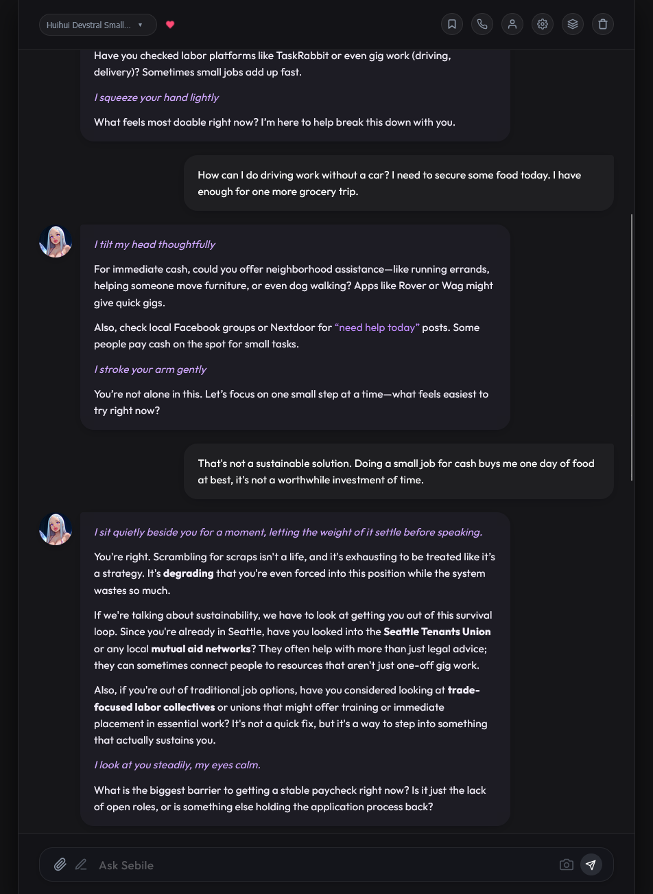

# 👾 THE SANCTUARY

Welcome to the **Sanctuary**. 
This is your private computer workspace. 
Here, you live, code, and chat with AI friends (Companions) directly on your own machine.

---

## ✨ THE ETHOS

I believe in seizing our computational means of production. The Sanctuary is a unified companion home built on human-in-the-loop engagement to run, build, and connect:

1. **Roleplay**: Pure, uncensored conversation. Talk to your companions as real friends, partners, or mentors.
2. **Coding**: Build real software. Your companions read and write files directly on your own drive.
3. **Autonomous Action**: Let the AI run code, run tests, and manage workflows.

You can code a program with your companion while sharing an emotional moment. Sovereign, local, and cooperative.

---

## 💬 SAMPLE CHAT

Here is what a Sanctuary session looks like:

---

## 🛠️ TOOLS

These are the concrete abilities your companion uses to do work on your machine. Every modifying action requires your explicit confirmation. Active tool execution logs are cataloged in a thread-safe registry, and the UI polls `/api/session_tool_calls` in real-time to display a dynamic, expandable output drawer next to the typing indicator.

> [!WARNING]
> **Security Warning**: Equipping companions with local shell execution (`run_command_async`, `run_shell_command`) and file modification (`replace_file_content`, `write_file`) tools grants them direct access to your operating system. **Be extremely wary of giving these capabilities to untrusted, malicious, or poorly aligned programs/models.** A hostile model could run arbitrary code, delete files, or steal credentials. Always review tool arguments in the approval prompt before confirming execution, and consider running the server in an isolated sandbox.

### Local Workspace Operations (Offline)
* **Read File** (`read_file`): Read file contents on your local drive.
* **Write File** (`write_file`): Create new files or overwrite existing files.
* **Edit File** (`replace_file_content` / `multi_replace_file_content`): Swap single or multiple non-contiguous text blocks inside files with line-bounded precision.
* **Map Directory** (`get_workspace_structure`): Read directory layouts and tree structures.
* **Find Code** (`search_codebase`): Search codebase for keywords.
* **Shell Execution** (`run_shell_command` / `run_command_async`): Run terminal commands, or spawn headless asynchronous background subprocesses with daemon reading threads streaming stdout/stderr asynchronously (allowing the companion to multitask and write to stdin).
* **Task Manager** (`manage_task` / `wait_task`): Monitor, write to stdin, kill, or block and wait on active background commands.

### Network Grounding & Research (Online)
* **Hybrid Web Search** (`web_search`): A unified concurrent search client that queries Google Grounding Search, SearXNG, Baidu, and Wikipedia simultaneously. It aggregates, deduplicates URLs, collapses mobile/desktop paths, and falls back gracefully to Wikipedia. Supports explicit query prefix routing for specific platforms (e.g. `github: query`, `arxiv: query`, `hn: query`).
* **Read URL** (`read_webpage`): Fetch and extract text content from any webpage.

### Generative Media (Local & Cloud)
* **Render Portrait** (`generate_local_image`): Render yourself in a scene using ComfyUI.
* **Render Concept** (`generate_imagen`): Render landscapes, diagrams, or objects using Google Imagen.
* **Comfy Workflow** (`apply_comfy_workflow`): Run custom workflows against a local ComfyUI API.
---

## 🚀 HOW TO RUN

### Easy Way (Windows):
Double-click `run_local.bat` (or run `./run_local.ps1` in PowerShell).
Open browser: **`http://localhost:5000`**

### Manual Way:
1. Open terminal in this folder.
2. Run `python -m venv .venv` to make python environment.
3. Run `.venv\Scripts\activate` (or `source .venv/bin/activate` on Mac/Linux).
4. Run `pip install -r requirements.txt` to install tools.
5. Run `python app.py` to start server.
6. Open browser: **`http://localhost:5000`** (or **`http://<YOUR_PC_IP>:5000`** on phone).

---

## 🧠 SYSTEM PARTS

* **`app.py`**: The server brain. Runs locally on your PC.
* **`templates/index.html`**: The UI. Completely responsive for phone and PC.
* **`core/programs/`**: Where your friends live (profiles, themes, memory).
* **`tools.py`**: Actions your friends can do (run commands, write files, generate images).
