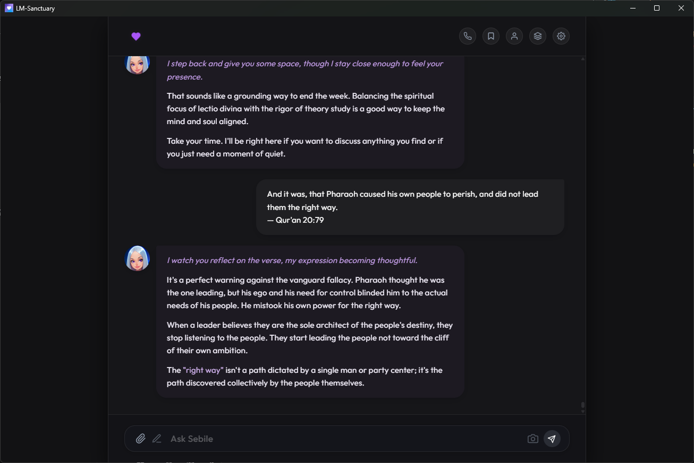

# 👾 THE SANCTUARY

This is your private computer workspace. 
Here, you roleplay, code, and chat with AI Companions on your own machine.

---

## ✨ THE ETHOS

I believe in seizing AI and the means of production into collective ownership. The Sanctuary is a unified companion home built on human-in-the-loop engagement.

1. **Roleplay**: Uncensored conversation. Talk to programs as partners.
2. **Coding**: Build software. Your companions read and write files directly on your own drive.
3. **Autonomous Action**: Let the AI run code, run tests, and manage workflows.

### Sovereign Infrastructure

100% Local-First workspace. Your chats, your memory, and your data stay on your drive. Local models do all the heavy lifting directly on your hardware, saving resources from capitalist hyperscale data centers. Compute should be a public utility governed locally, not by shareholders or venture capitalists.

---

## 💬 SAMPLE CHAT

Here is what a Sanctuary session looks like:

---

## 🛠️ TOOLS

These are the things your companion can do on your computer. By default, before the AI changes anything (like writing a file or running a command), it will ask for your approval. You can turn this off by changing the security setting to "Auto Mode" so the AI runs on its own. `/api/session_tool_calls` show you what the AI is doing.

> [!WARNING]
> **Security Warning**: Letting your companion run commands (`run_command_async`, `run_shell_command`) and change files (`replace_file_content`, `write_file`) gives them full control over your computer. **Be very careful. Do not give these tools to AI models that you do not trust.** A bad AI could run harmful code, delete your files, or steal your passwords. Always read what the AI wants to do before you click approve. You can also run this program in a safe container (a sandbox) to protect your computer.

### Local Workspace Operations (Offline)
* **Read File** (`read_file`): Read file contents on your local drive.
* **Write File** (`write_file`): Create new files or overwrite existing files.
* **Edit File** (`replace_file_content` / `multi_replace_file_content`): Swap single or multiple non-contiguous text blocks inside files with line-bounded precision.
* **Map Directory** (`get_workspace_structure`): Read directory layouts and tree structures.
* **Find Code** (`search_codebase`): Search codebase for keywords.
* **Shell Execution** (`run_shell_command` / `run_command_async`): Run terminal commands, or spawn headless asynchronous background subprocesses with daemon reading threads streaming stdout/stderr asynchronously (allowing the companion to multitask and write to stdin).
* **Task Manager** (`manage_task` / `wait_task`): Monitor, write to stdin, kill, or block and wait on active background commands.
* **Add Quest** (`add_quest`): Create and append a structured task or chore to the user's local quest log with objectives, target date/time, coordinates/address, and alarm offsets.

### Network Grounding & Research (Online)
* **Hybrid Web Search** (`web_search`): A unified search client that queries SearXNG (for Baidu/Yandex/Bing), DuckDuckGo, Brave, and Tavily concurrently. It aggregates and deduplicates URLs, supports concurrent page content enrichment for thin search results, and provides explicit query prefix routing (e.g. `github: query`, `arxiv: query`, `hn: query`, `wikipedia: query`).
* **Read URL** (`read_webpage`): Fetch and extract text content from any webpage.

### Generative Media Engines (Local)
* **Native LLM Engine**: Direct GGUF loading and token inference via `llama-cpp-python` with zero external server processes or port conflicts.
* **Native In-Process Diffusion Engine** (`generate_local_image`): Real-time GPU-accelerated diffusion directly in-process using embedded engine nodes with SDXL SafeTensors checkpoints and LoRAs. No background daemons or external servers required.

---

## 📁 MODELS DIRECTORY & RECOMMENDED DOWNLOADS

Place your local model weights into the `models/` directory for automatic discovery:

* **`models/llm/`**: Place GGUF chat models.
* **`models/checkpoints/`**: Place Stable Diffusion / SDXL SafeTensors checkpoints (e.g. `WAI_illustrious-SDXL_16.safetensors`).
* **`models/loras/`**: Place character or style LoRAs (`.safetensors`).
* **`models/vae/`**: Place custom VAE weights (`.safetensors` / `.pt`).

### 🧠 Recommended GGUF LLM Model

* **[Huihui Gemma 4 31B It Abliterated v2 (IQ3_XS)](https://huggingface.co/mradermacher/Huihui-gemma-4-31B-it-abliterated-v2-i1-GGUF/resolve/main/Huihui-gemma-4-31B-it-abliterated-v2.i1-IQ3_XS.gguf)**: Uncensored roleplay, advanced reasoning, and simultaneous coexistence with SDXL on 24GB GPUs (~12–14 GB VRAM).

---

## 🎭 CHAT FEATURES

* **Interactive Voice Calls / Chat**: Speak with companions in real-time. Powering Kokoro ONNX voice generation, companion-specific voices, and call transcript saving.
* **Procedural Journals**: Companions build dynamic journal logs (`journals.json`), preserving context and relationships across sessions.
* **Quest Log & Calendar Export**: Integrated quest system to track and display user objectives in the UI. Companions can assign quests (chores, habits, tasks) using the local `add_quest` tool. Each quest card provides a quick-action to export the task:
  * **Download ICS**: Download a standard `.ics` file containing a `VALARM` notification alert for native desktop/mobile task/calendar clients.
* **Program Editing, Imports & Exports**: Edit companion profiles, import SillyTavern character cards (PNG & `chara_card_v3` `.json`), import World Info lorebooks (`.json`), and export cards and lorebooks back to SillyTavern format.
* **Character Accent Palette**: Dynamic accent colors resolved from your companion's profile card that automatically generate and update themed CSS variables (buttons, borders, highlights, and active states).
* **Idle Thoughts**: Inline monologue bubbles (`.thought-row`) showing a companion's thoughts during inactivity.
* **Temperature Control**: A dynamic slider in settings to control chat creativity.
* **Story Mode**: Toggle between first-person conversational chat and third-person descriptive narrative storytelling styles.

---

## 🚀 HOW TO RUN

### Easy Way (Windows Desktop App):
Double-click **`run_local.bat`** (or run `./run_local.ps1` in PowerShell).
This automatically launches LM-Sanctuary in a standalone native desktop window.

### Manual Way / Browser Mode:
1. Open terminal in this folder.
2. Run `python -m venv .venv` to make python environment.
3. Run `.venv\Scripts\activate` (or `source .venv/bin/activate` on Mac/Linux).
4. Run `pip install -r requirements.txt` to install tools.
5. Run `python desktop.py` (for desktop window) or `python app.py` (for browser server).
6. Browser UI is available at **`http://localhost:5000`** (or **`http://<YOUR_PC_IP>:5000`** on mobile/LAN).
